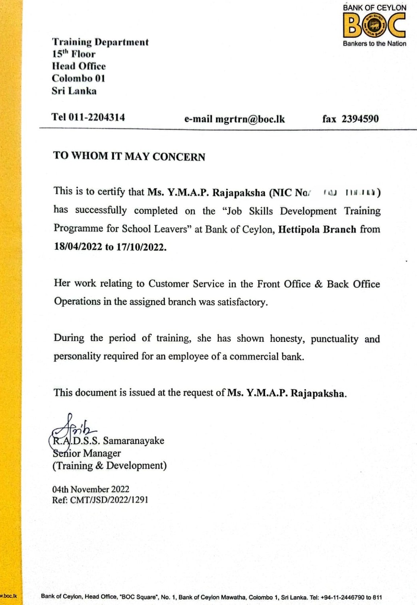
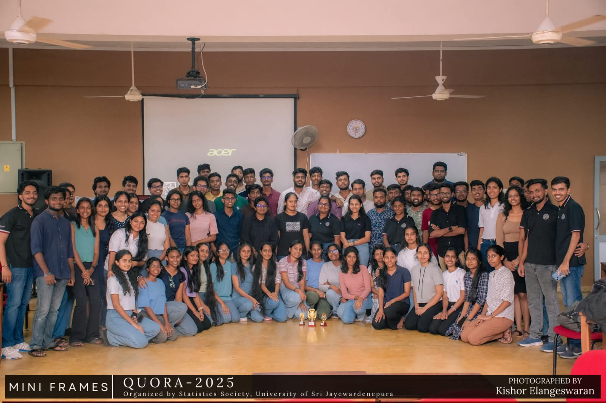
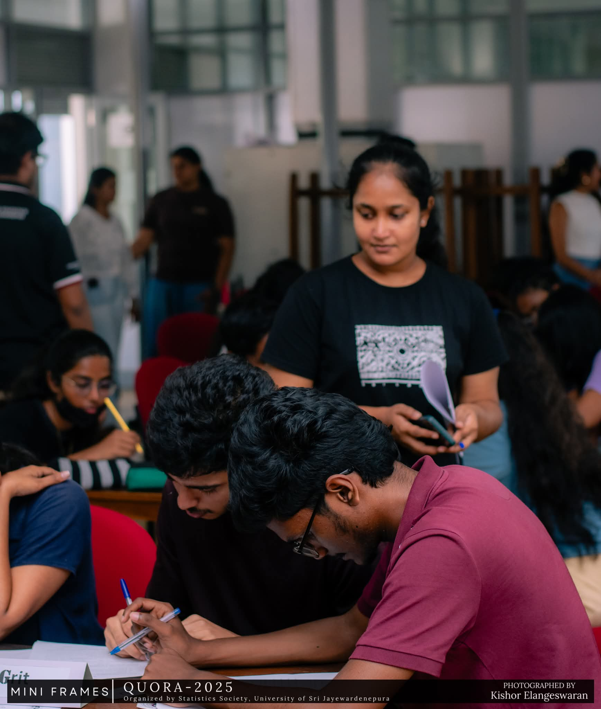
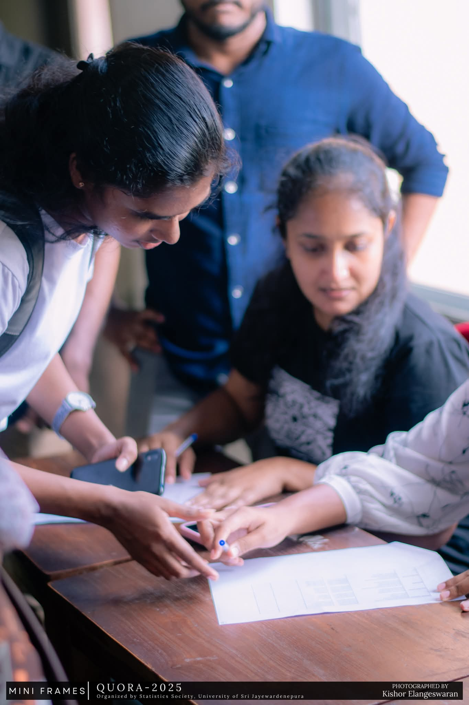
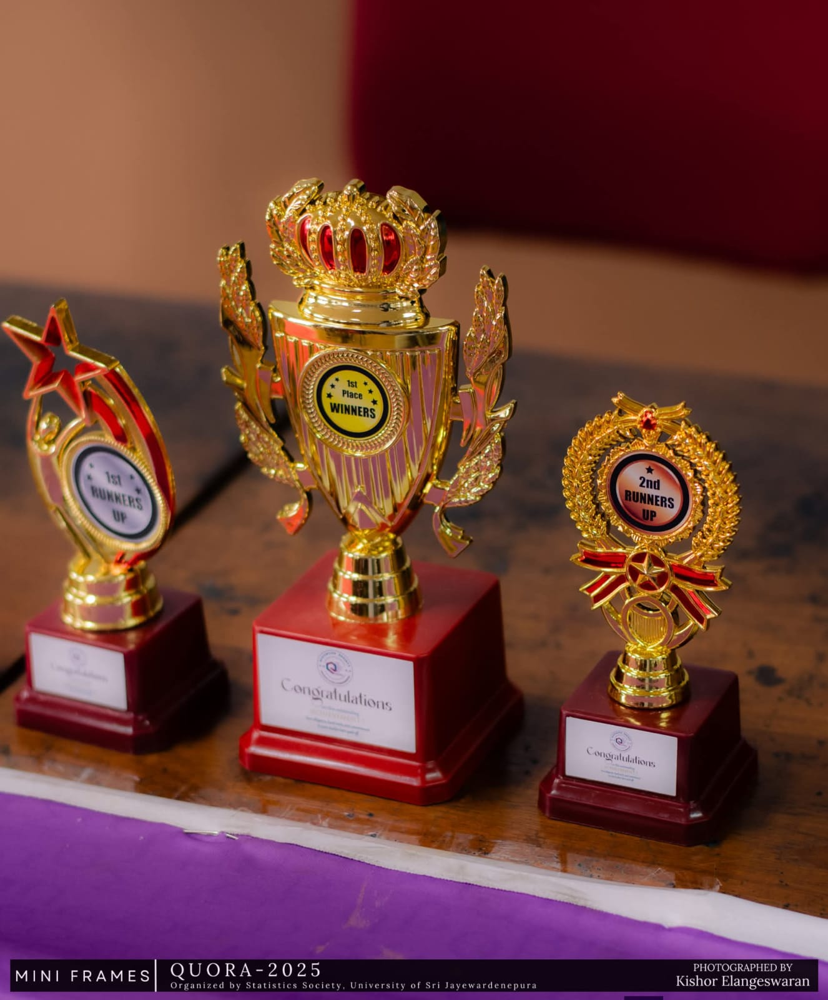

# **💼 Work Experience**

### **Intern**

[Bank of Ceylon](https://www.boc.lk), Hettipola Branch\
Apr 2022- Oct 2022

-   Facilitated opening, maintenance, and closure of savings accounts and fixed deposits

-   Managed customer account services, including passbook updates and issuance of banking documents

-   Assisted in delivering digital banking solutions and customer support for online services

-   Delivered efficient front-line customer service in a high-volume banking environment

::: text-center
{.round-img width="10cm"}
:::

::: vspace
:::

# **🤝 Volunteering**

### **Quora 3.0 - Statistic Society**

[Department of Statistics, University of Sri Jayewardenepura](https://science.sjp.ac.lk/sta/)\
Jun 2025

-   Helped organize Quora 3.0, an annual quiz competition for first-year students.

-   Worked with team members to manage event activities and support participant engagement.

::::: columns
::: {.column width="68%"}
{.round-img}
:::

::: {.column width="30%"}
{.round-img}
:::
:::::

::::: columns
::: {.column width="48%"}
{.round-img}
:::

::: {.column width="48%"}
{.round-img}
:::
:::::
