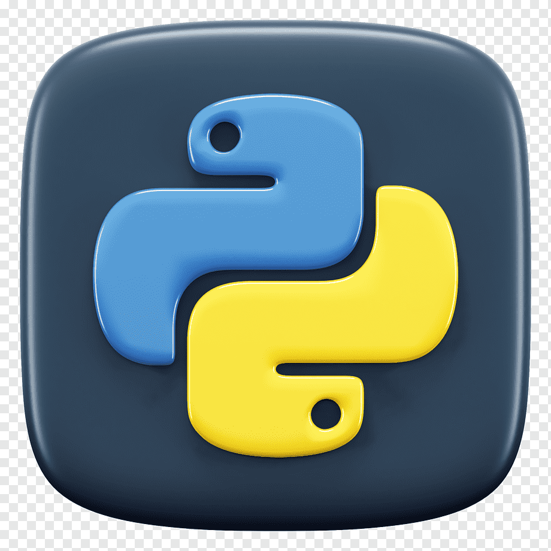
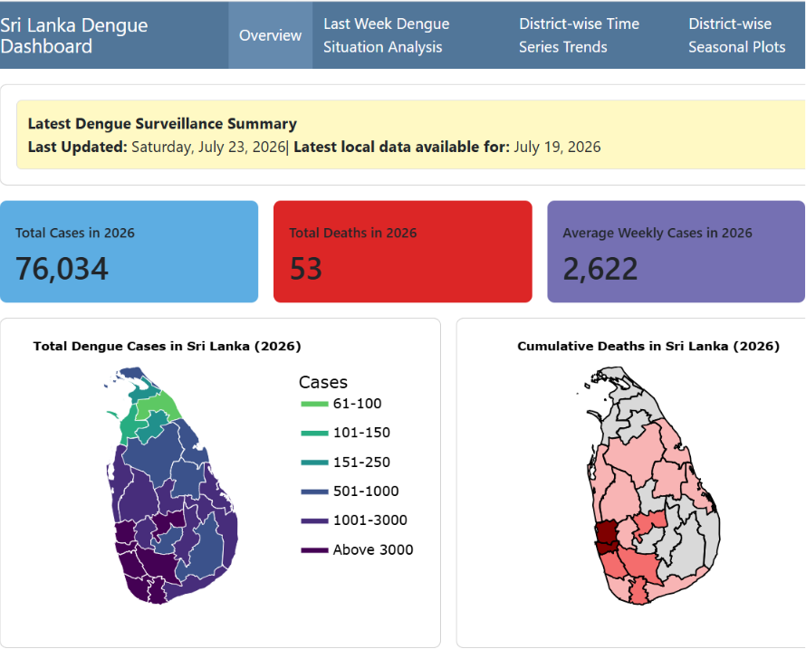

::::: grid
::: {.g-col-12 .g-col-md-6 .project-card}
{width="100px" style="float:left; margin-right:1em;"}

### **Ditwah Data Hub Project**

**Description**: Converted unstructured PDF reports on Cyclone Ditwah into structured, analysis-ready data and developed an interactive platform to visualize and monitor its impacts in Sri Lanka under the supervision of [Dr. Thiyanga Talagala](https://thiyanga.netlify.app/)\

**Tech Stack**: R, ggplot2, Data Visualization, Geospatial Analytics\
\
[View Project](https://thiyangt.github.io/DitwahDataHub/){.view-project-btn target="_blank"}
:::

::: {.g-col-12 .g-col-md-6 .project-card}
{width="100px" style="float:left; margin-right:1em;"}

### **Python for Data Science: A Course for R Users**

**Description**: Developed an interactive introductory course on Python for Data Science, designed to help R users learn essential Python concepts and workflows for data analysis through practical examples and hands-on exercises.\

**Tech Stack**: Python, Jupyter Notebook, Pandas, NumPy, Matplotlib, Data Science, R\
\
[View Project](https://akt-python-workshop26.share.connect.posit.cloud/){.view-project-btn target="_blank"}
:::
:::::

::::: grid
::: {.g-col-12 .g-col-md-6 .project-card}
{width="100px" style="float:left; margin-right:1em;"}

### **Forecasting Commodity Net Export Price Index (CNEPI)**

**Description**: Developed an ARIMA model to forecast the Commodity Net Export Price Index, Individual Commodities Weighted by Ratio of Net Exports to GDP (CNEPI) of Sri Lanka\

**Tech Stack**: R, ARIMA, Forecast Package, Time Series Analysis, Data Visualization\
\
[View Project](projects/project2.qmd){.view-project-btn target="_blank"}
:::

::: {.g-col-12 .g-col-md-6 .project-card}
{width="100px" style="float:left; margin-right:1em;"}

### **Sri Lanka Dengue Dashboard: A Web-Based Decision Support Tool**

**Description**: This dashboard provides an interactive overview of the dengue situation in Sri Lanka using the latest available surveillance data.\

**Tech Stack**: R, Quarto Dashboard, Spatio-Temporal Analyses, plotly, dplyr, tidyr, ggplot2\
\
[View Project](projects/dengue_dashboard.qmd){.view-project-btn target="_blank"}
:::
:::::

::::: grid
::: {.g-col-12 .g-col-md-6 .project-card}
{width="100px" style="float:left; margin-right:1em;"}

### **DS Job Tracker Survey**

**Description**: Collected data science and statistics job advertisement data and transformed it into a study-ready dataset through data wrangling and preprocessing.\

**Tech Stack**: R, Shiny, Excel, Data Wrangling\
\
[View Project](projects/project4.qmd){.view-project-btn target="_blank"}
:::

::: {.g-col-12 .g-col-md-6 .project-card}
{width="100px" style="float:left; margin-right:1em;"}

### **Interactive Demographic and Health Data Dashboard for Australia**

**Description**: Developed an interactive R Shiny dashboard for exploring and visualizing demographic and health related data for Australia, enabling user-friendly analysis of key population and health indicators.\

**Tech Stack**: R, shiny, shinydashboard, plotly, dplyr, tidyr, ggplot2\
\
[View Project](projects/project3.qmd){.view-project-btn target="_blank"}
:::
:::::

:::: grid
::: {.g-col-12 .g-col-md-6 .project-card}
{width="100px" style="float:left; margin-right:1em;"}

### **Statistical Process Control Chart Application**

**Description**: This Shiny app allows users to explore X̄ (mean) and R (range) control charts for quality control. It is developed for learning purposes and demonstrates Phase I and Phase II charting. This can also be used in industrial settings.

**Tech Stack**: R, shiny, dplyr, ggplot2, DT\
\
[View Project](https://github.com/amalirajapaksha/Xbar_R_charts){.view-project-btn target="_blank"}
:::
::::

