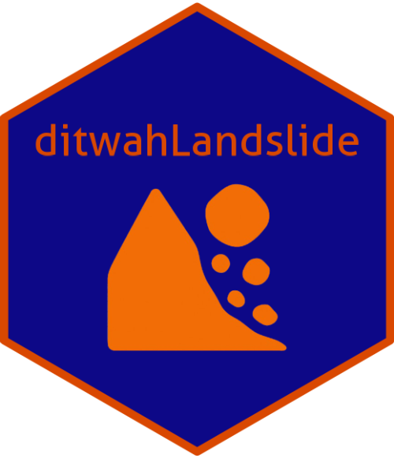
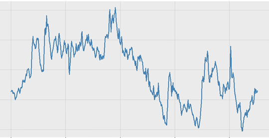
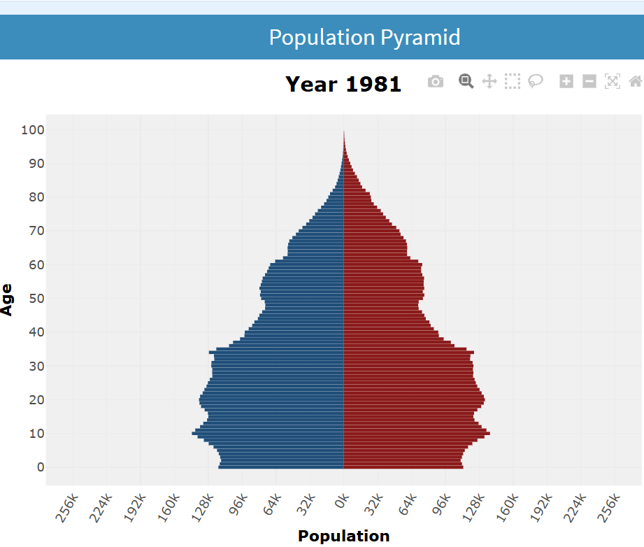
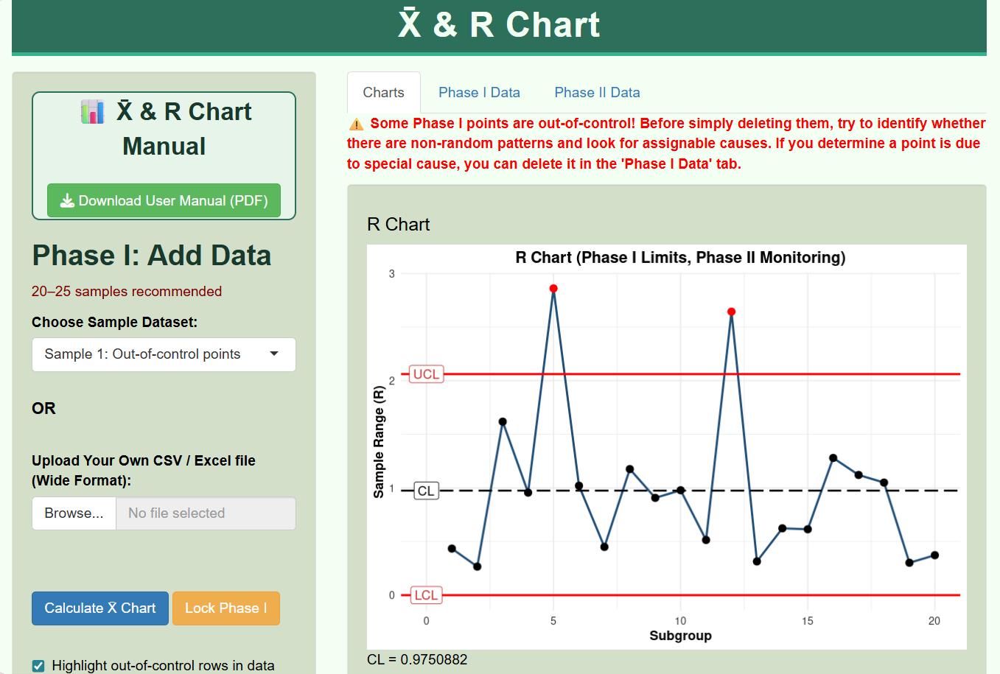

::::: grid
::: {.g-col-12 .g-col-md-6}
{width="100px" style="float:left; margin-right:1em;"}

### Ditwah Data Hub Project

**Description**: Converted unstructured PDF reports on Cyclone Ditwah into structured, analysis-ready data and developed an interactive platform to visualize and monitor its impacts in Sri Lanka.\

**Tech Stack**: R, Quarto, ggplot2, Data Visualization, Geospatial Analytics\
[View Project](projects/project1.qmd)
:::

::: {.g-col-12 .g-col-md-6}
{width="100px" style="float:left; margin-right:1em;"}

### Forecasting Commodity Net Export Price Index (CNEPI)

**Description**: Developed an ARIMA model to forecast the Commodity Net Export Price Index, Individual Commodities Weighted by Ratio of Net Exports to GDP (CNEPI) of Sri Lanka\

**Tech Stack**: R, ARIMA, Forecast Package, Time Series Analysis, Data Visualization\
[View Project](projects/project2.qmd)
:::
:::::

::::: grid
::: {.g-col-12 .g-col-md-6}
{width="100px" style="float:left; margin-right:1em;"}

### Interactive Demographic and Health Data Dashboard for Australia

**Description**: Developed an interactive R Shiny dashboard for exploring and visualizing demographic and health related data for Australia, enabling user-friendly analysis of key population and health indicators.\

**Tech Stack**: R, shiny, shinydashboard, plotly, dplyr, tidyr, ggplot2\
[View Project](projects/project3.qmd)
:::

::: {.g-col-12 .g-col-md-6}
{width="100px" style="float:left; margin-right:1em;"}

### DS Job Tracker Survey

**Description**: Collected data science and statistics job advertisement data and transformed it into a study-ready dataset through data wrangling and preprocessing.\

**Tech Stack**: R, Shiny, Excel, Data Wrangling\
[View Project](projects/project4.qmd)
:::
:::::

:::: grid
::: {.g-col-12 .g-col-md-6}
{width="100px" style="float:left; margin-right:1em;"}

### X̄ & R Charts Shiny App

**Description**: This Shiny app allows users to explore X̄ (mean) and R (range) control charts for quality control. It is developed for learning purposes and demonstrates Phase I and Phase II charting.

**Tech Stack**: R, shiny, dplyr, ggplot2, DT \
[View Project](https://github.com/amalirajapaksha/Xbar_R_charts)
:::
::::
